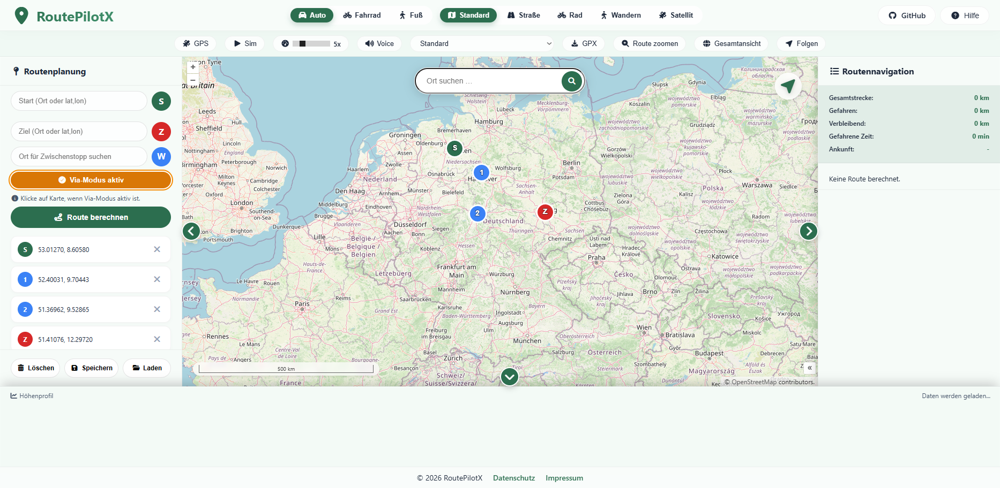
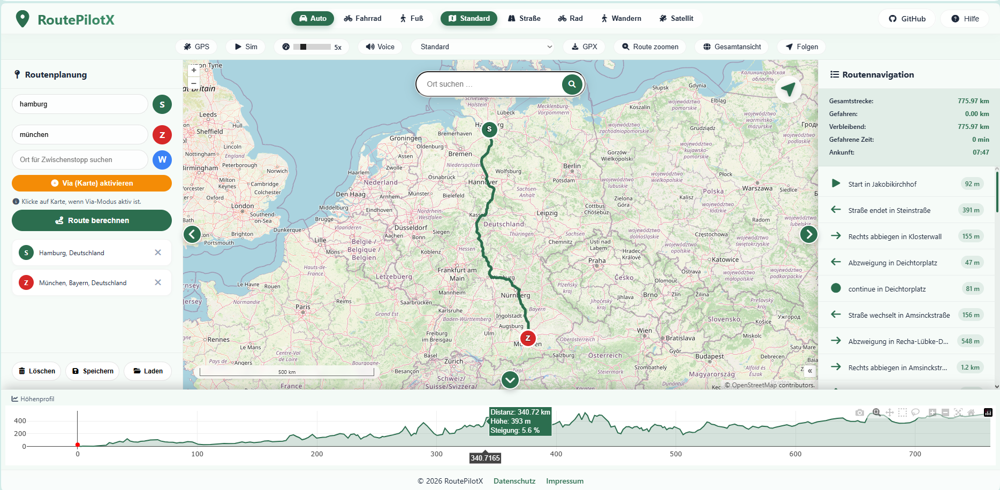
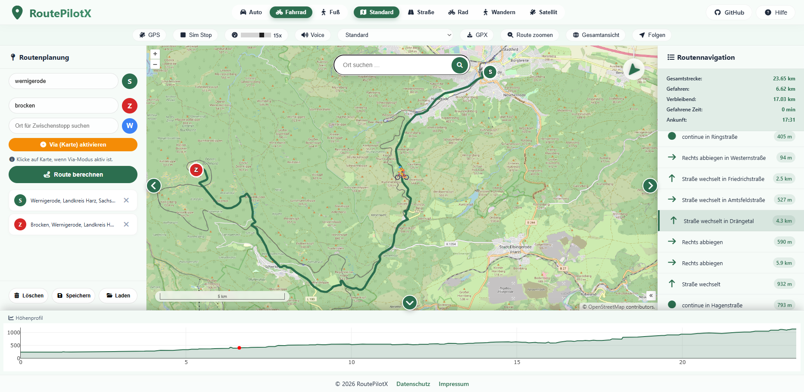
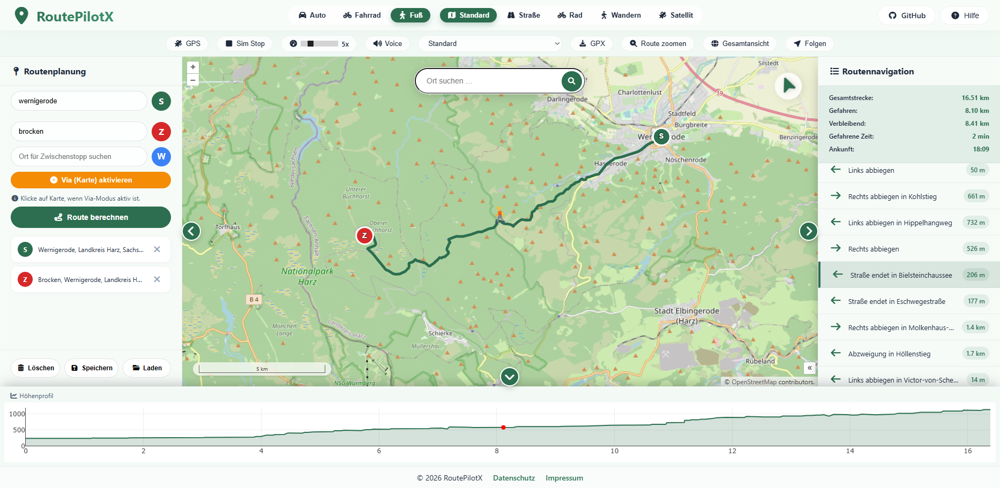
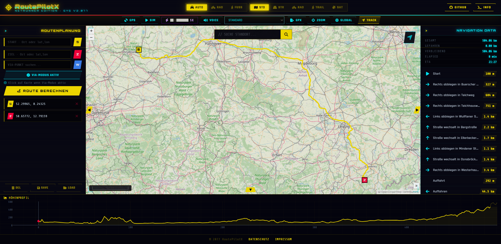
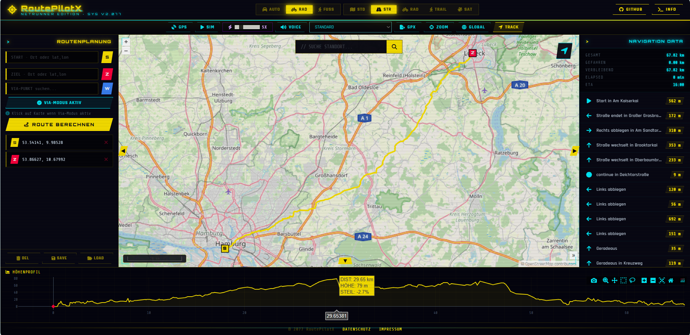
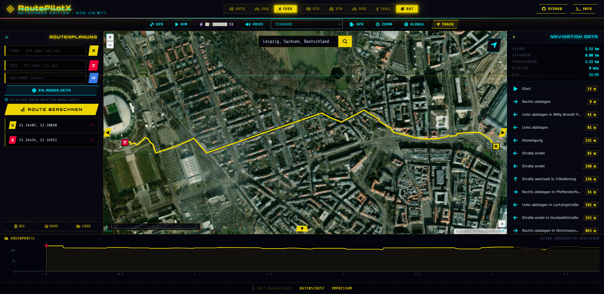

# RoutePilotX – Professionelle Multi‑Profil‑Routenplanung

---

## Professionelle Routenplanung. Multi‑Profil. Sofort einsatzbereit.

**RoutePilotX** ist eine hochperformante, containerisierte Webanwendung für Routenberechnung und Visualisierung für Auto, Fahrrad und Fußgänger. Mit OSRM‑Routing, OpenLayers‑Karten und interaktiven Plotly‑Diagrammen bietet RoutePilotX eine sofort einsatzbereite Lösung für Logistik, Tourismusportale, Flottenmanagement und individuelle Mobilitätslösungen.

Ob Unternehmensanwendung, individuelle Projekte oder Cloud‑Integration – mit RoutePilotX planen Sie **präzise, effizient und professionell**.

---

# 🖥️ Showcase – Funktionsbeispiele

## 1️⃣ Gesamtüberblick & Wegpunkte

# RoutePilotX – Professionelle Multi‑Profil‑Routenplanung

---

## Professionelle Routenplanung. Multi‑Profil. Sofort einsatzbereit.

**RoutePilotX** ist eine hochperformante, containerisierte Webanwendung für Routenberechnung und Visualisierung für Auto, Fahrrad und Fußgänger. Mit OSRM‑Routing, OpenLayers‑Karten und interaktiven Plotly‑Diagrammen bietet RoutePilotX eine sofort einsatzbereite Lösung für Logistik, Tourismusportale, Flottenmanagement und individuelle Mobilitätslösungen.

Ob Unternehmensanwendung, individuelle Projekte oder Cloud‑Integration – mit RoutePilotX planen Sie **präzise, effizient und professionell**.

---

# 🖥️ Showcase – Funktionsbeispiele

### 1️⃣ Gesamtüberblick & Wegpunkte

### 2️⃣ Profil – Auto (default)

### 3️⃣ Profil – Fahrrad (default)

### 4️⃣ Profil – Fußgänger (default)

### 5️⃣ Profil – Auto (optional CPS)

### 6️⃣ Profil – Fahrrad (optional CPS)

### 7️⃣ Profil – Fußgänger (optional CPS)

---

# 🚀 Highlights

* **Drei Routing‑Profile** – Auto, Fahrrad, Fußgänger mit dedizierten OSRM‑Containern
* **Interaktive Wegpunktverwaltung** – Start, Ziel, Zwischenstopps per Drag & Drop
* **Intelligente Ortsauflösung** – Ortnamen oder exakte Koordinaten (lat, lon)
* **Via‑Modus & GPX‑Export** – Einfache Zwischenstopps und GPS‑Kompatibilität
* **Echtzeit-Fahrsimulation** – Mit Sprachausgabe und dynamischem Routing
* **Kartenlayer** – OSM, Rad-/Wanderkarten, Satellitenbilder
* **Vollständig responsiv** – Desktop und Tablets
* **Docker‑basiert** – Einfache On‑Premise oder Cloud‑Installation

---

# 🗺️ Funktionsübersicht

## 📚 Routenplanung & Wegpunkte

* Start-, Ziel- und beliebig viele Zwischenpunkte
* Drag & Drop zur Sortierung
* Via-Modus: Klicke direkt auf Karte für Zwischenstopps
* Schritt‑für‑Schritt Navigation mit Entfernungsangaben
* Unterhalb der Statistik-Anzeige wird der gesamte Routenverlauf visualisiert

## 🧭 Profil & Analyse

* Interaktive Diagramme mit Distanz, Höhe, Steigung
* Maus-Hover für Detailinformationen
* Plotly Charts zur visuellen Analyse
* Routenverlauf direkt unter der Statistik-Anzeige sichtbar

## 🌐 Simulationsmodus & Sprachausgabe

* Virtuelle Fahrt entlang der Route
* Geschwindigkeit einstellbar
* Dynamische Anzeige der verbleibenden Strecke und Ankunftszeit
* Deutsche Sprachansagen für Abbiegehinweise
* Routenverlauf unterhalb der Statistik während Simulation sichtbar

## 🖼️ Karten & Layer

* OpenLayers 10.8 als Frontend-Kartenbibliothek
* Verschiedene Kartenlayer: Standard, Rad-/Wanderkarten, Satellit
* GPS-Tracking der aktuellen Position

## 📦 Routen speichern, laden & exportieren

* Browserbasierte Speicherung (IndexedDB/localStorage)
* GPX-Export für GPS-Geräte und andere Anwendungen

---

# 🔧 Technische Basis

| Komponente      | Technologie                        |
| --------------- | ---------------------------------- |
| Routing-Engine  | OSRM (Open Source Routing Machine) |
| Frontend-Karte  | OpenLayers                         |
| Diagramme       | Plotly.js                          |
| Container       | Docker + Docker Compose            |
| Backend-Skripte | Bash (init.sh) + OSRM Werkzeuge    |
| Datenquellen    | OpenStreetMap, Open-Elevation API  |

---

# 🏢 Für professionelle Nutzung konzipiert

* Präzise, Multi-Profil Routenplanung
* Integration in Unternehmens- und Cloud-Umgebungen
* Anpassbare OSRM-Profile und Kartenlayer
* Docker-basierte On-Premise oder Cloud-Bereitstellung
* Erweiterbar für individuelle Anforderungen

---

# 📦 Abonnement & Lizenzmodell

**RoutePilotX** wird als **Subscription-Modell** angeboten – transparent, skalierbar und ohne versteckte Kosten.

> 🚀 **Jetzt Angebot anfordern** – kontaktieren Sie uns für eine individuelle Beratung und Lizenzierung.

## 🔹 Basic – 49 € / Monat

Ideal für Einzelanwender und kleinere Projekte

* Enthält **nur das Auto-Profil (Car)**
* Bis zu 2 gleichzeitige Instanzen
* Standard-GPX-Export
* E-Mail-Support

## 🔹 Professional – 199 € / Monat

Für Teams, Agenturen und mittelständische Unternehmen

* Enthält **Auto- und Fahrrad-Profil (Car + Bicycle)**
* Inklusive **Höhenprofil & statistischer Auswertung**
* Bis zu **8 gleichzeitige Instanzen**
* Unbegrenzte Routenberechnungen
* JSON-Projekt-Export/Import
* Prioritäts-Support

## 🔹 Enterprise – Individuelles Angebot

Für Behörden, Großunternehmen und Infrastrukturbetreiber

* Enthält **alle Profile (Car, Bicycle, Foot)**
* On-Premise-Installation
* Individuelle Anpassungen & SLA
* Dedizierter Ansprechpartner
* Integration zusätzlicher Datenquellen
* Individuelle Routing-Profile

---

# 📞 Kontakt

**wm87 GbR**
Musterstraße 123
12345 Musterstadt
Deutschland

E‑Mail: [info@geoportal-de.example](mailto:info@geoportal-de.example)
Telefon: +49 123 4567890
Handelsregister: HRB 98765
USt‑ID: DE987654321

---

# 📄 Rechtliches

Die bereitgestellten Geodaten unterliegen den Lizenzbedingungen der jeweiligen Datenquellen (Bund, Länder, BKG, OpenStreetMap u.a.).
Für Inhalte externer Dienste wird keine Haftung übernommen.
Design und Software sind Eigentum der wm87 GbR.

---

**Die zentrale Plattform für professionelle Routenplanung, Analyse und Simulation.**
